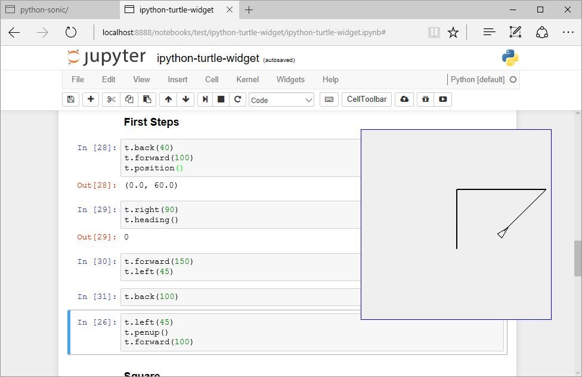
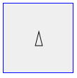
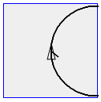

# ipython-turtle-widget
## Creating Turtle Graphics in IPython/Jupyter

Draw on the page or use an extra window. **under construction**



If you like it, use it. If you have some suggestions, tell me (gkvoelkl@nelson-games.de).

## Install

### To install use pip:
```
$ pip install ipyturtle
$ jupyter nbextension enable --py --sys-prefix ipyturtle
```
### For a development installation (requires npm),
```
$ git clone https://github.com/gkvoelkl/ipython-turtle-widget.git
$ cd ipython-turtle-widget
$ pip install -e .
$ jupyter nbextension install --py --symlink --sys-prefix ipyturtle
$ jupyter nbextension enable --py --sys-prefix ipyturtle
```
## Examples

The most examples are inspired by **Harold Abelson, Andrea diSessa: Turtle Geometry, MIT Press 1986**

### Start


```python
from ipyturtle import Turtle
t = Turtle()
t
```

The turtle is drawn on its own part of the screen.  

<br><br><br><br><br><br><br>

Or integrate the turtle graphic into the page


```python
t2 = Turtle(fixed=False, width=100, height=100)
t2
```



With *width* and *height* you can change the extension of the drawing canvas.

### First Steps


```python
t.back(40)
t.forward(100)
t.position()
```


    (0.0, 60.0)


```python
t.right(90)
t.heading()
```


    0


```python
t.forward(150)
t.left(45)
```


```python
t.back(100)
```


```python
t.left(45)
t.penup()
t.forward(100)
```

### Square


```python
t.reset() #clear canvas and start again
```


```python
def square(size):
    for i in range(4):
        t.forward(size)
        t.right(90)
```


```python
square(20)
```

### Triangel


```python
t.reset()
```


```python
def triangle():
    for i in range(3):
        t.forward(100)
        t.right(120)
```


```python
triangle()
```

### Circle


```python
t = Turtle(fixed=False, width=120, height=120)

def circle():
    for i in range(360):
        t.forward(1)
        t.right(1)

t
```




```python
circle()
```

## Changelog

0.2.0 First published version

## Sources

More about Creating Custom Widgets in IPython https://github.com/ipython/ipywidgets  
A template Widget Project https://github.com/ipython/ipywidgets  


```python

```
